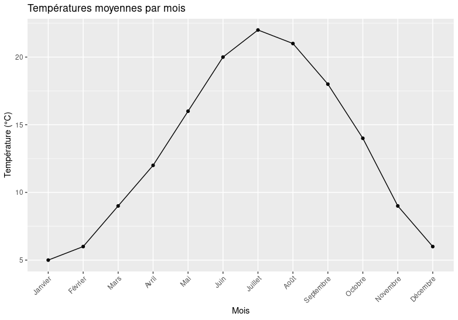
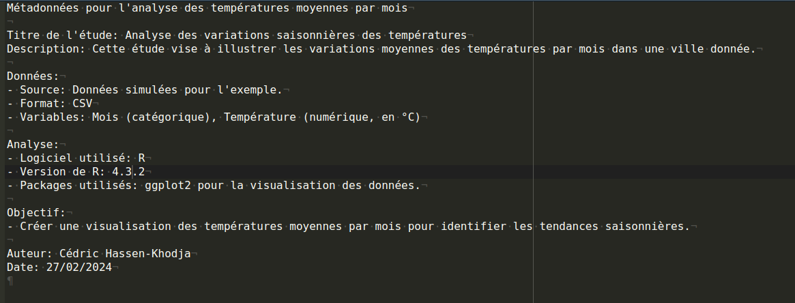
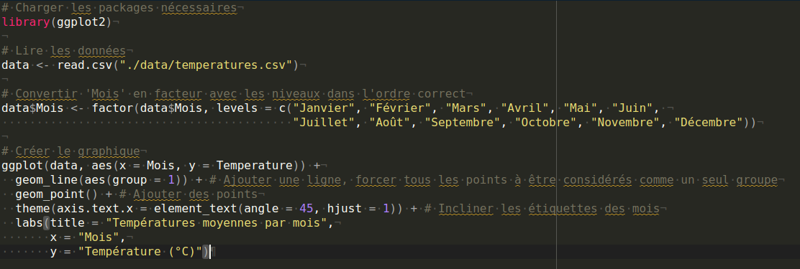
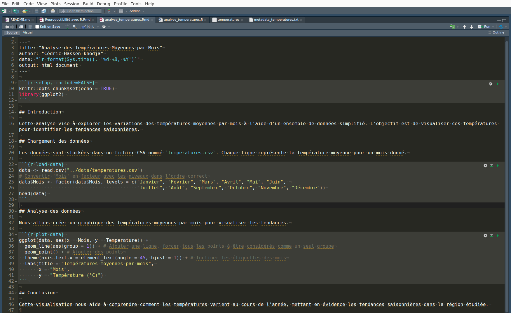
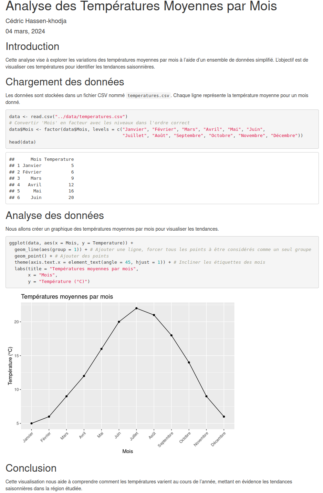
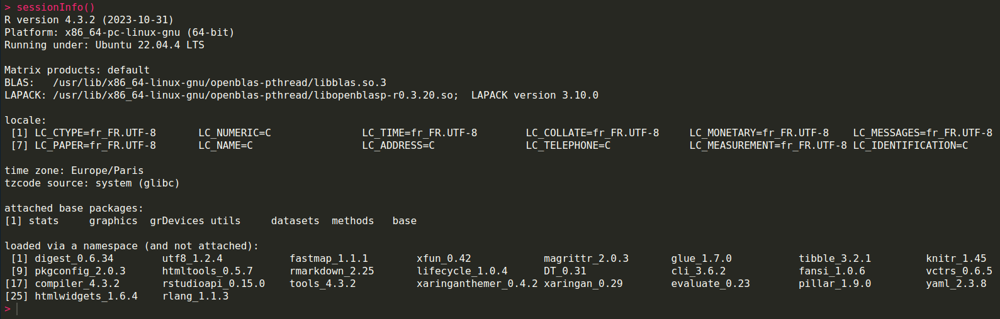
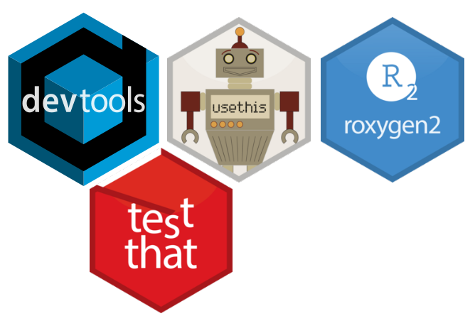
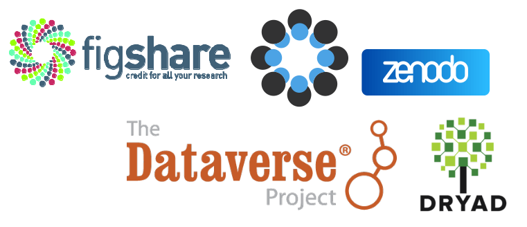

```{r setup, include=FALSE}
options(htmltools.dir.version = FALSE)
knitr::opts_chunk$set(
  fig.width=9, fig.height=3.5, fig.retina=3,
  out.width = "100%",
  cache = FALSE,
  echo = TRUE,
  message = FALSE, 
  warning = FALSE,
  hiline = TRUE
)
```

```{r xaringan-themer, include=FALSE, warning=FALSE}
library(xaringanExtra)
library(xaringanthemer)
style_duo_accent(
  primary_color = "#035AA6",
  secondary_color = "#03A696")
```

```{r xaringanExtra, echo = FALSE}
xaringanExtra::use_progress_bar(color = "#0051BA", location = "top", height = "10px")
```

<!-- Cette session va aborder la question de reproductibilité, ici grâce à l'outil R. On verra toutefois des similitudes ou des compaaisons à faire avec Python. Ici je vais aborder qq pratiques et packages ou outil essentiel dans la recherche de reproductibilité-->

## La recherche reproductible

**La recherche reproductible :** une recherche dont toutes les informations pertinentes sont accessibles, permettant à n'importe quel chercheur indépendant de reproduire les résultats.

--

**La réplication :** l'obtention de résultats cohérents en utilisant un jeu de données différent.

--

**La répétabilité :** l'obtention de résultats cohérents en utilisant la même méthodologie dans le même cadre expérimental.

---

<!-- Imaginons que vous venez de lire une étude fascinante en bioinformatique. Vous êtes impressionnés par les résultats et souhaitez vérifier par vous-même leur fiabilité. Premièrement la reproductibilité, qui permet à partir des données originales de l'étude, du code et des instructions fournies de voir si vous pouvez arriver aux mêmes résultats. Cela teste si l'étude est reproductible, c'est-à-dire si d'autres chercheurs peuvent suivre les mêmes étapes et obtenir les mêmes résultats 
Ensuite, vous explorez la réplicabilité. Pour cela, vous appliquez les méthodes décrites dans l'étude à un nouvel ensemble de données que vous avez collecté, qui est similaire mais pas identique à celui de l'étude originale. Si vous arrivez à des conclusions similaires, cela indique que les résultats de l'étude sont réplicables.
Enfin la répétabilité. Vous décidez de refaire l'analyse exactement comme elle a été faite dans l'étude, en utilisant les mêmes données, le même code, et si possible, le même environnement de traitement. Si vous obtenez les mêmes résultats, cela démontre la répétabilité de l'étude, affirmant que les résultats sont fiables dans des conditions expérimentales identiques.-->

## La figure seule

```{r fig, echo=FALSE, eval=TRUE, out.width='70%'}

```

<!-- Considérons cette slide intitulée 'La figure seule', qui présente un cas pratique : un graphique des températures moyennes par mois. La figure illustre une courbe saisonnière typique, avec des températures augmentant graduellement jusqu'en été avant de diminuer vers l'hiver. Si notre objectif est de reproduire ces résultats, la figure seule pose un défi significatif.
La recherche reproductible exige que nous partagions non seulement la figure finale, mais aussi les données brutes, les scripts de traitement et les détails méthodologiques. Sans ces éléments, la possibilité pour d'autres chercheurs de reproduire ou de répliquer cette analyse est extrêmement limitée.-->

---

## La figure avec les données

.pull-left[
```{r fig2, echo=FALSE, eval=TRUE, out.width='70%'}

```
]
.pull-right[

```{r data, echo=FALSE}
data <- read.csv("./data/temperatures.csv")
data
```
]

<!-- Avec les données en main, nous pouvons examiner les points individuels qui composent notre graphique des températures moyennes par mois. Les données sans contexte ne nous permettent pas de comprendre pleinement l'analyse. Par exemple, on ne comprend pas comment ont été généré les données et le graphique. Quel outil ont été utilisé.-->

---

## La figure avec les données et les métadonnées

.pull-left[
```{r fig3, echo=FALSE, eval=TRUE, out.width='80%'}

```

```{r metadata, echo=FALSE, out.width='80%'}

```
]
.pull-right[
```{r data2, echo=FALSE}
data <- read.csv("./data/temperatures.csv")
data
```
]

<!-- nous faisons un pas de plus vers la reproductibilité. Cette fois, non seulement la figure et les données nous sont présentées, mais elles sont également accompagnées d’informations précieuses qui décrivent le contexte de l’étude : les métadonnées.

Ces métadonnées incluent des détails tels que :

    Le titre de l’étude : "Analyse des variations saisonnières des températures"
    La description du but de l’étude : Illustrer les variations des températures moyennes par mois dans une ville donnée.
    La source : Données simulées pour l'exemple.
    Les variables utilisées : Mois et Température, avec le format des données (.CSV).
    Les outils d’analyse : Le logiciel R avec la version spécifique 4.3.2, et l’utilisation du package ggplot2 pour la visualisation des données.
    L’objectif : Créer une visualisation des températures moyennes par mois pour identifier les tendances saisonnières.

En fournissant ces informations, l’auteur, Cédric Hassen-Khodja, permet aux autres chercheurs de comprendre non seulement ce qui a été étudié et avec quels outils, mais aussi comment reproduire l’analyse.-->

---

## La figure avec les données, les métadonnées et le script

.pull-left[
```{r fig4, echo=FALSE, eval=TRUE, out.width='80%'}

```

```{r metadata2, echo=FALSE, out.width='80%'}

```
]
.pull-right[
```{r data3, echo=FALSE}
data <- read.csv("./data/temperatures.csv")
data
```

```{r fig5, echo=FALSE}

```
]

<!-- Cette slide représente le summum de la reproductibilité dans notre séquence. Non seulement nous avons une visualisation des données et les métadonnées qui fournissent le contexte nécessaire, mais nous avons également le script qui a été utilisé pour générer la figure.

Avoir le script est essentiel car il nous offre la possibilité de retracer chaque étape du processus analytique de l'étude. -->

---

## Un projet RStudio et Rmarkdown

.pull-left[
```{r rmarkdown, echo=FALSE}

```
]
.pull-right[
```{r htmlreport, echo=FALSE, out.width='66.5%'}

```
]

<!-- RStudio, en tant qu'environnement de développement intégré, et RMarkdown, qui permet de créer des documents dynamiques, forment un duo puissant pour les chercheurs travaillant avec R. 
De même Python offre également des outils équivalents. JupyterLab et Jupyter Notebooks, par exemple, fournissent une interface interactive pour le code, les données et le texte narratif, similaire à celle de RMarkdown. Dans un écosystème Python, ces notebooks sont souvent complétés par des IDE tels que PyCharm ou Spyder,-->

---

## Un projet RStudio, Rmarkdown et sessionInfo

.pull-left[
```{r rmarkdown2, echo=FALSE}

```

```{r session, echo=FALSE}

```
]
.pull-right[
```{r htmlreport2, echo=FALSE, out.width='66.5%'}

```
]

<!-- L'ajout de sessionInfo() dans un projet RStudio avec Rmarkdown, pour détailler l'environnement de la session et assurer une meilleure reproductibilité.
Maintenant on va voir différents packages qui facilitent la recherche reproductible-->  

---

## Les gestionnaires de packages

.pull-left[
 `r htmltools::img(src = "./logos/renv.svg", height="100px", width="100px")`
<br>
<br>
<br>
 `r htmltools::img(src = "./logos/minicran.svg", height="100px", width="100px")` 
]

.pull-right[
 checkpoint
<br>
<br>
<br>
<br>
<br>
<br>
 `r htmltools::img(src = "./logos/groundhog.png", height="69px", width="130px")` 
]

<!-- Prenons renv, par exemple. Ce gestionnaire de packages spécifique pour R permet de capturer l'état exact des packages R utilisés dans un projet. Cela signifie que vous pouvez reconstituer cet environnement ultérieurement, sur n'importe quelle machine, assurant ainsi que vos analyses peuvent être reproduites fidèlement, indépendamment des mises à jour ou des changements dans les packages que vous avez utilisés.
Minicran est un autre outil, permettant de créer un CRAN miniature, une sous-section de CRAN, qui contient uniquement les packages nécessaires pour un projet. 
checkpoint s'adresse directement au défi de la reproductibilité à travers le temps. En fixant une date spécifique, checkpoint garantit que vous utilisez les versions des packages qui étaient disponibles à ce moment-là, ce qui vous protège contre les effets indésirables des mises à jour ultérieures.
Le gestionnaire de packages groundhog offre une approche novatrice pour la gestion des dépendances en R, en vous permettant de charger des versions spécifiques des packages pour chaque jour précis, garantissant ainsi que le code peut être exécuté et produira les mêmes résultats aujourd'hui comme dans le futur 
Avec Python, on peut utiliser pip, conda et un environnement virtuel si on se situe par projet-->
---

## Make-like pipeline tool &nbsp; &nbsp; &nbsp; &nbsp; &nbsp; &nbsp; `r htmltools::img(src = "./logos/targets.svg", height="80.8px", width="73.7px")` 


1. **Automatisation de Workflows Complexes.**

2. **Reproductibilité.**

3. **Parallélisation Efficace.**

4. **Gestion Intégrée des Erreurs.**

5. **Facilité de Maintenance.**

6. **Intégration Harmonieuse.**

7. **Documentation Complète.**

<!-- Automatisation de Workflows Complexes: Avec targets, vous définissez un plan de workflow, où chaque étape (ou "target") dépend de l'aboutissement des étapes précédentes.
Reproductibilité: Targets permet de réexécuter l'ensemble du workflow de manière transparente et sans erreur.
Targets gère l'exécution parallèle des tâches, accélérant les opérations.
Gestion Intégrée des Erreurs: Targets permet d'identifier et localiser précisément ou se situe l'erreur dans votre script.
Facilité de Maintenance: De fait du plan de workflow mise en place, le code devient plus facile à maintenir et à mettre à jour.
Intégration Harmonieuse: targets s'intègre harmonieusement dans l'écosystème R, en travaillant de concert avec d'autres packages et outils.
Documentation Complète: Une documentation exhaustive aide les nouveaux utilisateurs à se familiariser rapidement avec l'outil, et sert de référence fiable pour les utilisateurs avancés. -->

---

## "Packager" son analyse

<div class="pull-left" style="font-size: 18px;">
1. Les packages organisent le code de manière modulaire.<br>
<br>
2. Ils simplifient le partage et la réutilisation du code.<br>
<br>
3. Ils simplifient la maintenance du code.<br>
<br>
4. Ils gèrent les dépendances de manière automatique.<br>
<br>
5. Ils intègrent des outils pour documenter et tester le code.<br>
<br>
6. Ils promeuvent les bonnes pratiques de développement.<br>
<br>
7. Ils contribuent à la qualité du code.<br>
<br>
8. Ils encouragent la collaboration entre développeurs.<br>
<br>
9. Ils facilitent le déploiement du code.<br>
</div>

.pull-right[
```{r packages, echo=FALSE}

```
]

<!--Transformer votre analyse en un package présente de nombreux avantages pour la reproductibilité et la collaboration. Cela structure votre code de manière modulaire, facilite le partage, la réutilisation, et la maintenance du code. Les packages gèrent automatiquement les dépendances, offrent des outils pour documenter et tester le code, encourageant ainsi les bonnes pratiques de développement et contribuant à la qualité du code. C'est une démarche qui renforce la collaboration entre développeurs et simplifie le déploiement du code.-->

---

## Utiliser des containers &nbsp; &nbsp; &nbsp; &nbsp; &nbsp; &nbsp; `r htmltools::img(src = "./logos/docker-logo-blue.svg", height="53.1px", width="233.4px")`

```{r docker, echo=FALSE, out.width='90%'}
knitr::include_graphics("./fig/docker-architecture.webp")
```

<!-- Utiliser Docker, comme l'illustre la diapositive, c'est adopter un outil puissant pour la containerisation, une pratique essentielle pour la reproductibilité et la gestion d'environnements de développement. Docker encapsule des applications dans des conteneurs indépendants, garantissant que le logiciel fonctionne uniformément malgré les différences entre les environnements de développement et de production. La commande docker run exécute un conteneur, docker build crée une image Docker à partir d'un Dockerfile, et docker pull télécharge des images depuis un registre. Cette architecture isole les applications, simplifie les déploiements, et permet une gestion précise des versions et des dépendances, contribuant ainsi à la reproductibilité et à la facilité d'entretien des projets de recherche en informatique. -->

---

## Systèmes de gestion de version

| Caractéristique | Git                               | GitLab                            | GitHub                            |
|-----------------|-----------------------------------|-----------------------------------|-----------------------------------|
| Type            | Système de contrôle de version    | Plateforme de gestion de projets  | Plateforme de développement      |
| Hébergement     | Local ou sur des serveurs distants| Peut être auto-hébergé ou en cloud| En cloud, propriété de Microsoft  |
| Fonctionnalités | Basique                           | Avancées, incluant CI/CD         | Avancées, incluant CI/CD         |
| Collaboration   | Peut être limitée aux collaborateurs locaux | Collaboration sur projets, issues, merge requests | Collaboration sur projets, issues, pull requests |
| Intégration     | Intégration avec des outils tiers | Intégration native avec des outils de développement | Intégration native avec des outils de développement |
| Popularité      | Très populaire, largement utilisé | Populaire parmi les développeurs | Très populaire, utilisé par de nombreux projets open-source |

<!-- Les systèmes de gestion de version comme Git, GitLab et GitHub offrent des plateformes pour le suivi des modifications, la collaboration et l'intégration/déploiement continu (CI/CD). Git est largement utilisé pour le contrôle de version local ou sur des serveurs distants. GitLab ajoute des fonctionnalités pour la gestion de projets, y compris des outils CI/CD, et peut être auto-hébergé ou utilisé dans le cloud. GitHub, appartenant à Microsoft et basé dans le cloud, est une plateforme de développement populaire intégrant des outils avancés pour la collaboration sur des projets open-source et autres. Ces outils facilitent la collaboration en équipe avec des fonctionnalités telles que les issues et les requêtes de tirage ou fusion (pull requests ou merge requests), tout en permettant une intégration aisée avec d'autres outils de développement. -->

---

## Les données

- Stocker / archiver ses données dans un dépôt respectant les principes FAIR.

```{r datacenter, echo=FALSE, out.width='60%'}

```

<!-- Pour conclure notre présentation sur la reproductibilité avec R, il est crucial de reconnaître l'importance des dépôts de données dans la recherche scientifique. Des plateformes comme Figshare, Dataverse, Zenodo et Dryad jouent un rôle vital en permettant aux chercheurs de partager, d'archiver et de créditer leurs données de recherche. Elles assurent l'accessibilité et la préservation à long terme des ensembles de données, ce qui renforce l'intégrité de la recherche et facilite la collaboration. Ces ressources sont inestimables pour la communauté scientifique et contribuent à la pérennisation du savoir.-->

---

#### Merci

  [cedrichk.github.io/reproductibilite-avec-R/](https://cedrichk.github.io/reproductibilite-avec-R/)    
</br>
  [Code de la présentation](https://github.com/CEDRICHK/reproductibilite-avec-R)

---

```{r session-presentation, echo=FALSE}
sessionInfo()
```

---

## Ressources

<div class="small-text">

<ul>
  <li><strong>Jupyter Notebooks</strong> : <br>Environnement interactif pour créer et partager des documents contenant du code, des visualisations et du texte. <br><a href="https://jupyter.org/">Site Web</a></li>
  <br>
  <li><strong>R Markdown</strong> : <br>Extension de Markdown pour créer des rapports dynamiques et reproductibles avec du code intégré. <br><a href="https://rmarkdown.rstudio.com/">Site Web</a></li>
  <br>
  <li><strong>Git</strong> : <br>Système de contrôle de version pour suivre les modifications du code et collaborer avec d'autres chercheurs. <br><a href="https://git-scm.com/">Site Web</a></li>
  <br>
  <li><strong>Docker</strong> : <br>Plateforme de conteneurisation pour créer des environnements de développement isolés et reproductibles. <br><a href="https://www.docker.com/">Site Web</a></li>
  <br>
  <li><strong>Binder</strong> : <br>Service pour transformer des notebooks Jupyter en applications web interactives, facilitant le partage et la reproductibilité.<br> <a href="https://mybinder.org/">Site Web</a></li>
  <br>
  <li><strong>Snakemake</strong> : <br>Outil de gestion de workflow pour la création de pipelines de traitement de données reproductibles.<br> <a href="https://snakemake.readthedocs.io/en/stable/">Site Web</a></li>
  <br>
  <li><strong>targets</strong> : <br>Package R pour la définition et l'exécution de workflows reproductibles.<br><a href="https://books.ropensci.org/targets/">Site Web</a></li>
</ul>

</div>

